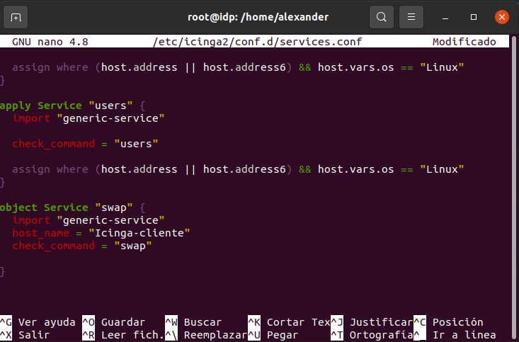

## Primero en el equipo principal ##

Accedemos al archivo  */etc/icinga2/conf.d/hosts.conf* añadiendo la siguiente linea

```bash
object Host "Nombre-cliente" {
    import "generic-host"
    address = "IP-Cliente"
}
```


Para monitorizar algo , en este ejemplo usaremos 'swap' para saber el espacio libre en el swap del equpo linux cliente  Accedemos al archivo  */etc/icinga2/conf.d/services.conf* añadiendo la siguiente linea

```bash
object Service "swap" {
  import "generic-service"
  host_name = "Icinga-cliente"
  check_command = "swap"

}
```



## En el navegador ya nos mostrará el otro equipo ##


Enlace a la [Guia Para monitorizar CPU , RAM y Disco duro](/agente.md)